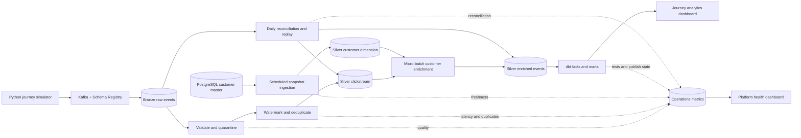

# Real-Time Telehealth Clickstream Analytics Platform

An end-to-end data engineering project that turns unreliable, continuously arriving telehealth product events and periodically refreshed customer attributes into reliable analytics data.

The platform simulates patient booking and virtual-visit journeys, transports events through Kafka, processes them with Spark Structured Streaming on Databricks, and stores raw and curated data in Delta Lake. Customer master data is ingested from PostgreSQL on a schedule and joined to behavioral events. dbt then builds business-ready facts and marts for product analytics and platform-health dashboards.

## Business questions

- Where do users leave the booking journey?
- How does booking conversion vary by device, specialty, membership plan, acquisition channel, and region?
- Which booked appointments progress to a started and completed virtual visit?
- Which appointments are still inside their observation window and should not yet count as incomplete?
- Are dashboards based on fresh, valid, deduplicated, and recoverable data?

## Architecture



See [Architecture](docs/architecture.md) for component responsibilities, data layers, recovery behavior, and deployment boundaries.

## Data products

| Product | Grain | Purpose |
|---|---|---|
| `fct_booking_journey` | One booking attempt | Ordered funnel stages and journey attribution |
| `fct_appointment` | One booked appointment | Cross-session, cross-day visit outcomes and maturity |
| `mart_booking_funnel` | Journey cohort day × business dimensions | Funnel counts, denominators, and conversion rates |
| `mart_visit_cohort` | Appointment cohort day × business dimensions | Mature appointment outcomes and completion rates |
| `mart_customer_activity_daily` | Day × customer × activity dimensions | Correct distinct-customer analysis after filtering |
| Platform health marts | Job × five-minute window | Freshness, latency, duplicates, invalid records, and recovery |

## Reliability rules

- Bronze preserves each Kafka delivery and its topic, partition, offset, schema ID, and raw payload.
- Invalid records are quarantined with explicit error codes; they are never silently discarded.
- A 30-minute event-time watermark bounds streaming deduplication state.
- An insert-only merge on `event_id` protects the durable event table from replay duplicates.
- Data that arrives beyond the real-time window is recovered from pre-watermark data during reconciliation.
- Customer enrichment is a left join and records the customer snapshot used.
- Each streaming query has an independent persistent checkpoint.
- dbt incremental models rebuild the complete history of affected journeys and appointments.

## Initial service objectives

These are targets to validate, not claimed results.

| Objective | Initial target |
|---|---:|
| Valid clickstream event to published Gold data, warm compute | p95 < 5 minutes |
| Customer source change to published dimension | p95 < 60 minutes |
| Real-time event-time lateness threshold | 30 minutes |
| Duplicate business events downstream | 0 in the acceptance dataset |
| Invalid event handling | 100% traceable to raw delivery and quarantine reason |
| Failure recovery | Resume and catch up within 10 minutes in the controlled test |
| Eventual completeness | Reconciled output matches the generator manifest |

See [Metric contracts](docs/metrics.md) for formulas, the [V1 data contract](docs/data-contract.md) for event and customer-source rules, [deterministic customer data](docs/customer-data.md) for source fixtures and update behavior, and [project scope](docs/project-scope.md) for assumptions and exclusions.

The Day 2 environment gate and redacted smoke-test instructions are in [Environment and connectivity](docs/day-02-environment.md).

## Repository layout

```text
contracts/          Event schemas, business rules, and data contracts
generator/          Stateful journey and customer-data simulation
pipelines/          Streaming, batch, and shared transformations
dbt_telehealth/     Facts, marts, tests, and dbt documentation
jobs/               Databricks job configuration
dashboards/          Exported dashboard definitions and screenshots
tests/               Unit, integration, contract, and recovery scenarios
docs/                Architecture, scope, metrics, and decisions
evidence/            Reconciliation, performance, recovery, and demo evidence
```

## Current acceptance status

- [x] Project scope and non-goals are explicit
- [x] Target users and business questions are defined
- [x] Architecture and component ownership are documented
- [x] Metric grains, denominators, and observation windows are defined
- [x] V1 event contracts, fixtures, validation rules, and customer DDL are executable
- [x] A deterministic 10,000-customer source snapshot and update workflow are validated
- [x] Thirty-day delivery plan has daily acceptance outputs
- [ ] Cloud services and end-to-end connectivity are verified
- [ ] Streaming and batch pipelines are implemented
- [ ] dbt models and dashboards are published
- [ ] Reliability and performance targets are measured

## Safety and privacy

The project uses synthetic product-analytics data only. It contains no real patient, clinical, diagnosis, payment, or protected health information. `visit_completed` represents an observed product event in the simulation, not independently verified clinical care.

Day 5 local journey simulation and reproduction: [guide](docs/day-05-journeys.md).
