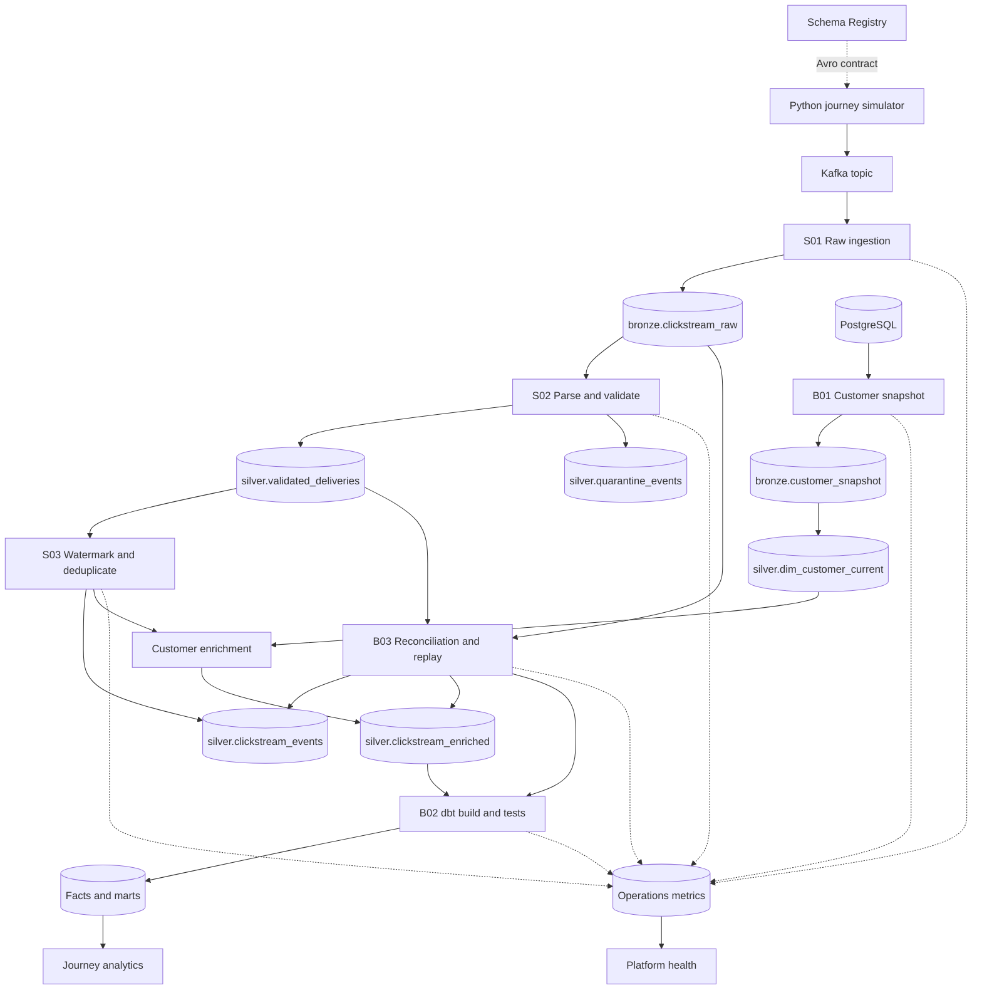

# Architecture

## System view

## Component responsibilities

| Component | Responsibility | Does not own |
|---|---|---|
| Journey simulator | Causal journeys, delayed delivery queue, retries, corrupt records, expected manifest | Analytical metrics |
| Kafka | Durable real-time transport and partition offsets | Business uniqueness or global event order |
| Schema Registry | Structural message contracts and compatibility checks | Event-specific business validation |
| Bronze clickstream | Immutable delivery evidence and replay source | Cleaning or business truth |
| Streaming validation | Parsing, structural and semantic rules, quarantine routing | Funnel logic |
| Streaming deduplication | Bounded state deduplication and durable unique-event insert | Late historical reconciliation |
| Customer snapshot pipeline | Complete snapshot extraction, validation, publication, and current dimension | Exact unobserved history between snapshots |
| Enrichment | Left join to one published customer snapshot and explicit match status | Aggregate metrics |
| dbt | Facts, observation windows, metric definitions, marts, tests, and documentation | Raw-stream reliability logic |
| Reconciliation | Compare pre-watermark deliveries with durable outputs and repair affected entities | Normal low-latency delivery |
| Dashboards | Consumption of published Gold and health views | Transformation of raw events |

## Storage layers and write semantics

| Dataset | Grain and key | Write behavior |
|---|---|---|
| `bronze.clickstream_raw` | Kafka delivery; topic + partition + offset | Append raw bytes, headers, key, schema ID, Kafka timestamp, and ingestion time |
| `bronze.customer_snapshot` | Snapshot customer; snapshot_id + customer_id | Append only after extraction completes; publish only after snapshot checks pass |
| `silver.validated_deliveries` | Valid delivery; raw_record_id | Idempotent append, before watermarking; retains duplicates and very late valid data |
| `silver.quarantine_events` | Invalid delivery and rule version; raw_record_id + rule_version | Idempotent append with raw reference and one or more error codes |
| `silver.clickstream_events` | Unique immutable business event; event_id | Watermark-aware deduplication followed by insert-only merge |
| `silver.dim_customer_current` | Current customer; customer_id | Valid full snapshot merged as Type 1; deleted customers become tombstones |
| `silver.clickstream_enriched` | Event plus customer context; event_id | Initial insert; controlled updates only for missing-dimension repair or versioned correction |
| `gold.fct_booking_journey` | Booking attempt; booking_journey_id | dbt incremental merge of complete history for affected IDs |
| `gold.fct_appointment` | Booked appointment; appointment_id | dbt incremental merge and scheduled maturity updates |
| Business marts | Cohort day and filtering dimensions | Rebuild small marts initially; optimize affected groups only after measurement |

## Event identity and ordering

- `raw_record_id` identifies one Kafka delivery using topic, partition, and offset.
- `event_id` identifies one immutable business event. Retries preserve the event ID and payload.
- `session_id` groups one visit to the product.
- `booking_journey_id` groups one booking attempt across page events.
- `appointment_id` connects booking and virtual-visit events across sessions and days.
- Kafka messages use `booking_journey_id` as the preferred key; appointment-only messages use `appointment_id`.
- The pipeline reconstructs business order with event time and IDs; it does not assume global Kafka ordering.

## Streaming jobs

### S01 — raw ingestion

Reads Kafka in roughly 10-second micro-batches and writes raw deliveries to Bronze with a dedicated persistent checkpoint. Payload parsing is not required for raw preservation.

### S02 — validation

Reads Bronze as a stream, resolves schema ID, decodes Avro, and evaluates common and event-specific rules. Events whose `event_time` is over five minutes in the future are quarantined before watermarking to prevent an invalid timestamp from advancing streaming state. Dependency outages fail and retry the job; they are not mislabeled as invalid customer records.

### S03 — clean and enrich

Reads valid deliveries, applies a 30-minute event-time watermark, and deduplicates by event ID. Each micro-batch selects one published customer snapshot, records its ID, and performs a left join. Anonymous events and `customer_not_found` events remain in the data.

Watermark deduplication bounds state but does not guarantee that every record outside the threshold appears in a separate output. Reconciliation compares the durable pre-watermark delivery table with unique-event output to find late omissions.

Each query has an independent checkpoint. Compatible restarts reuse it. Changes to a state key or state schema require a versioned query generation, a new checkpoint, and controlled replay.

## Customer semantics

The V1 customer process extracts a complete snapshot every 30 minutes. A snapshot becomes available to enrichment only after row-count, key uniqueness, domain, and completeness checks pass. A failed or partial extraction leaves the previous published snapshot active.

Enriched data means “customer attributes observed at the event's first successful processing.” Already matched history is not rewritten when a membership changes. A previously missing customer can be repaired later; the record stores the new snapshot, repair timestamp, and reason.

This design does not claim exact customer attributes as of `event_time`. A future SCD Type 2 model would require reliable effective timestamps and an interval join.

## Recovery and reconciliation

The daily reconciliation job scans recent ingestion time, not only recent event dates. It compares valid deliveries and raw evidence with durable unique events, restores valid events missed by the real-time watermark, repairs customer misses, identifies conflicting payloads for the same event ID, and sends affected journey and appointment IDs to dbt.

Repair and S03 writes to the same targets are coordinated so only one writer mutates each target at a time. Re-running the same `replay_id` is idempotent. Full historical replay first writes to an isolated replay schema, is reconciled, and is promoted only after review.

## Orchestration

| Job | Initial cadence | Dependency and publish rule |
|---|---|---|
| S01–S03 | Long-running micro-batch streams | Independent checkpoints; health checked approximately every minute |
| B01 customer snapshot | Every 30 minutes | Validate complete snapshot before publication |
| B02 dbt analytics | Attempt every 2 minutes without overlap | Facts → marts → critical tests → publish marker → dashboard refresh |
| B03 reconciliation | Daily and manually parameterized | Establish source boundary → compare → repair → rebuild → report |

The dashboard displays `mart_as_of`, `customer_snapshot_at`, and last refresh time. A schedule is not treated as proof of freshness; event-to-publish latency is measured.

## Environment and access boundaries

- Separate development and demo catalogs/schemas, topic configuration, and checkpoint prefixes.
- PostgreSQL extraction identity is read-only.
- Kafka identities are separated by production and consumption needs.
- Streaming code writes Bronze and Silver; dbt writes Gold; dashboards read published views.
- Secrets are injected through managed secret storage or environment variables and never committed.
- The selected runtime and connector versions are locked after Day 2 connectivity tests.

